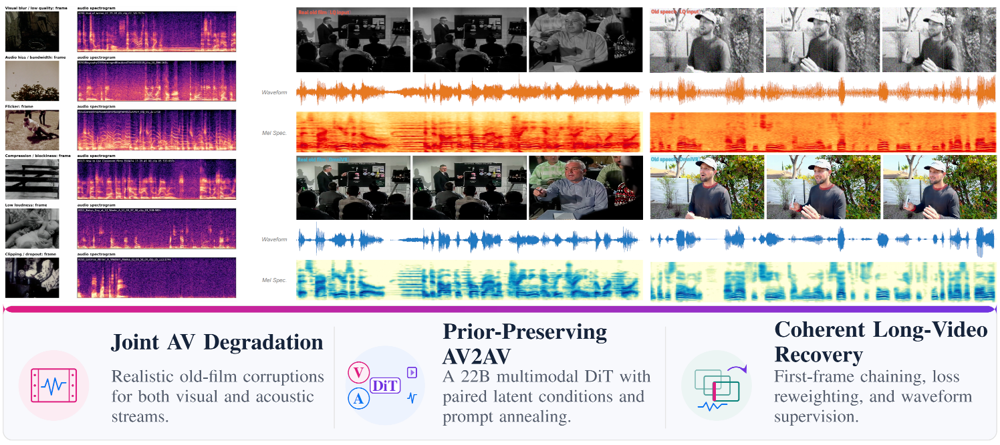
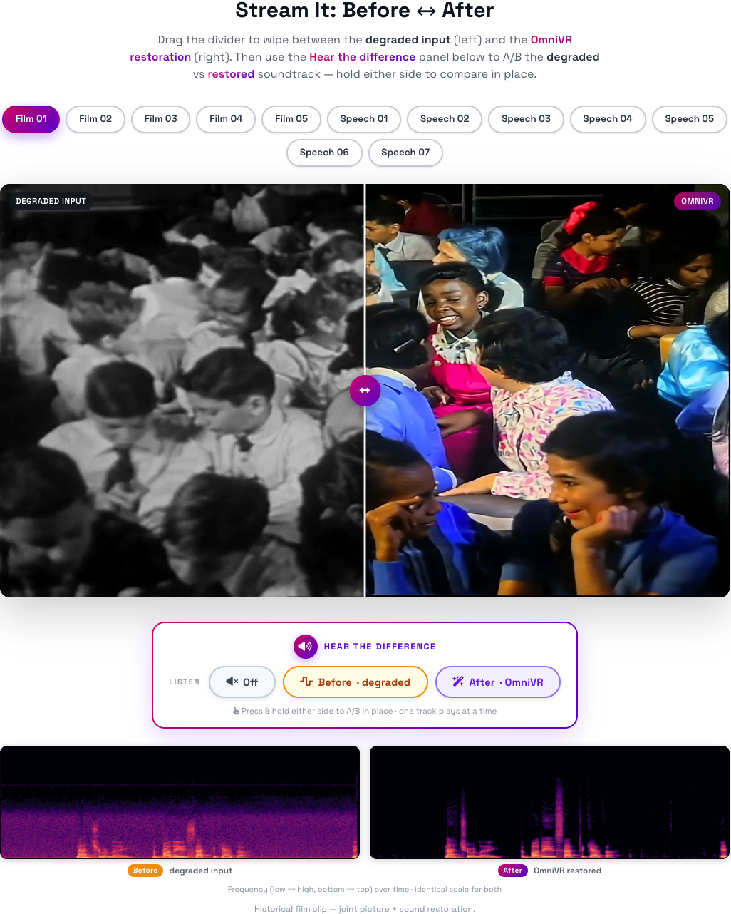

# 🎞️ OminiVR

**Joint Video-Audio Conditional Generation for Restoring Degraded Historical Films**

**Authors:** Xin Lu, Zihao Fan, Mingchen Zhong, Jie Huang, Xueyang Fu, Zheng-Jun Zha

<a href='https://xin1u.github.io/OminiVR_PAGE/'></a> &nbsp;
<a href="https://huggingface.co/xin1u/OmniVR"></a> &nbsp;
<a href="LICENSE"></a>



---

### 🌟 Abstract

Historical films suffer from co-occurring visual and audio degradations —
blur, noise, flicker, hiss, clipping, and dropout — yet existing methods
restore each modality independently, leaving quality gaps and cross-modal
inconsistency. We present **OmniVR**, the first joint audio-video generative
restoration model. Built upon a 22B-parameter audio-video generation
backbone, OmniVR formulates restoration as conditional generation within a
unified multimodal DiT: the low-quality video and audio are encoded as
latent conditions, combined with a fixed restoration prompt, and jointly
denoised to recover visual structure, temporal motion, and acoustic detail
under one coordinated objective. Three key designs enable this adaptation:
**(1)** a joint audio-video degradation pipeline that simulates real
old-film characteristics from Internet-collected data; **(2)** an
architecture-preserving text-to-audio-video (T2AV) to
audio-video-to-audio-video (AV2AV) transition with prompt annealing that
maximally retains the generative prior; and **(3)** first-frame
image-to-video (I2V) anchoring with loss reweighting and waveform
supervision for long-video extrapolation and audio fidelity. We also
propose **OmniVRBench**, the first benchmark that evaluates audio-video
restoration across visual quality, audio quality, temporal consistency, and
audio-visual synchrony on 200 real historical clips. OmniVR surpasses all
prior methods on all six visual metrics, achieves the best audio quality,
and produces natural colorization — the first method to jointly address all
three aspects.

---

### 📰 News

- **Aug 2026 — Inference code, LoRA weights, and OmniVRBench released** on
  GitHub and [Hugging Face](https://huggingface.co/xin1u/OmniVR). 🎉

---

### 📋 TODO

- ✅ Release inference code and LoRA weights
- ✅ Release the OmniVRBench evaluation set
- ⬜ Release training code and configs (not planned for this repository)

---

### 🚀 Getting Started

#### 1️⃣ Clone the Repository

```bash
git clone https://github.com/xin1u/OminiVR.git
cd OminiVR
```

#### 2️⃣ Install Dependencies

OminiVR is a LoRA adapter for Lightricks' [LTX-2](https://github.com/Lightricks/LTX-2)
and depends on its `ltx-core` / `ltx-trainer` / `ltx-pipelines` packages,
which are not vendored here:

```bash
pip install -e .

git clone https://github.com/Lightricks/LTX-2.git /path/to/ltx-2
export OMINIVR_DEPS_ROOT=/path/to/ltx-2/packages
```

#### 3️⃣ Download Model Weights and Data

All large binaries (base model, LoRA checkpoints, TinyDecoder, evaluation
set) are hosted on Hugging Face rather than in this git repository. OminiVR's
own weights, data, and reference outputs are all in a single repo,
[`xin1u/OmniVR`](https://huggingface.co/xin1u/OmniVR):

| What | Source | Notes |
|---|---|---|
| Base model + Gemma text encoder | [`Lightricks/LTX-2.3`](https://huggingface.co/Lightricks) | official upstream weights; governed by the [LTX-2 Community License](https://github.com/Lightricks/LTX-2/blob/main/LICENSE) |
| OminiVR LoRA weights (`step_01800`, `step_02400`) | [`xin1u/OmniVR`](https://huggingface.co/xin1u/OmniVR)`/weights/` | see [NOTICE](NOTICE) — these are a Derivative of LTX-2 |
| TinyDecoder weights (`taeltx2_3_wide.pth`) | [`xin1u/OmniVR`](https://huggingface.co/xin1u/OmniVR)`/tinydecoder/` | see [`ckpt/tinydecoder/README.md`](ckpt/tinydecoder/README.md) |
| OmniBench evaluation set | [`xin1u/OmniVR`](https://huggingface.co/xin1u/OmniVR)`/omnibench/` | see [`data/omnibench/README.md`](data/omnibench/README.md) |
| Reference inference outputs | [`xin1u/OmniVR`](https://huggingface.co/xin1u/OmniVR)`/predictions/` | precomputed restorations for both tracks, for quick comparison without rerunning inference |

We release two LoRA checkpoints from the same training run
(`v5_tav2av_hq`), matching the two evaluation tracks in the paper:

- **`step_01800`** — used for the `no_gt` / real-footage (no-reference) track
- **`step_02400`** — used for the `with_gt` / talking-head (full-reference) track

```bash
huggingface-cli download xin1u/OmniVR weights/ominivr_lora_step_01800.safetensors --local-dir .
huggingface-cli download xin1u/OmniVR weights/ominivr_lora_step_02400.safetensors --local-dir .
huggingface-cli download xin1u/OmniVR tinydecoder/taeltx2_3_wide.pth --local-dir ckpt

export OMINIVR_MODEL_PATH=/path/to/ltx-2.3-22b-dev.safetensors
export OMINIVR_TEXT_ENCODER_PATH=/path/to/gemma-3-12b-it-qat-q4_0-unquantized
export OMINIVR_LORA_STRUCTURE=/path/to/ltx-2.3-22b-distilled-lora-384.safetensors
```

`OMINIVR_LORA_STRUCTURE` only needs to point at *some* checkpoint sharing the
LoRA's target-module/rank structure (used to reconstruct the PEFT config
before loading weights); it defaults to `--checkpoint` itself if unset.

#### 4️⃣ Run Inference

```bash
python scripts/infer.py \
    --input_dir data/omnibench/no_gt \
    --output_dir /path/to/output \
    --checkpoint /path/to/ominivr_lora_step_01800.safetensors \
    --strategy neg_cfg \
    --guidance_scale 3.0 \
    --num_steps 30 \
    --condition_noise 0.3 \
    --width 1920 --height 1088 --max_frames 121 --frame_rate 24 \
    --stg_scale 1.0 --stg_blocks 29 --stg_mode stg_av \
    --audio_denoise --audio_denoise_highpass 200 --audio_denoise_over 2.5 --audio_denoise_floor 0.03
```

Three CFG sampling strategies are available via `--strategy`:

- `no_cfg` — guidance_scale=1.0, single forward per step (fastest)
- `empty_cfg` — positive=SR prompt, negative=empty string (matches training distribution)
- `neg_cfg` — positive=SR prompt, negative=negative prompt (strongest enhancement, used above)
- `all` — runs all three strategies on the same inputs, for comparison

Pass `--lq_grayscale` when restoring genuinely black-and-white old film
footage — training degraded ~50% of clips to grayscale, so the model expects
a grayscale LQ signal for that case.

**Multi-GPU**: pass `--num_gpus N` to data-parallelize across `N` GPUs (each
GPU processes a disjoint subset of input videos; round-robin assignment).
There is no FSDP/single-video-sharded inference mode in this release.

**TinyDecoder**: if `ckpt/tinydecoder/taeltx2_3_wide.pth` is present,
inference uses the fast TinyDecoder path (keeps the transformer resident on
GPU). If absent, it falls back automatically to the full VAE decoder
(slower, tiled to control memory).

---

### 🎬 Demo

Drag the divider to compare the degraded input against the OmniVR
restoration, and A/B the soundtrack — see the [project page](https://xin1u.github.io/OminiVR_PAGE/)
for the full interactive version with all clips.



---

### 🛠️ Method

The overview of **OmniVR**. This framework features:

* **Joint AV Degradation** — a pipeline that simulates realistic old-film
  corruptions for both visual and acoustic streams.
* **Prior-Preserving AV2AV** — a 22B multimodal DiT adapted via LoRA
  (rank 384) with paired latent conditions and prompt annealing, injecting
  the LQ condition by expanding `patchify_proj` from `Linear(128, dim)` to
  `Linear(256, dim)` and channel-concatenating the noisy latent with the LQ
  latent at each denoising step.
* **Coherent Long-Video Recovery** — first-frame (I2V) chaining, loss
  reweighting, and waveform supervision for temporally consistent,
  audio-fidelity-preserving long-form restoration.
* **OmniVRBench** — 200 real historical film clips across a `with_gt`
  (71-clip, full-reference) talking-head track and a `no_gt` (129-clip,
  no-reference) real-archival track.


---

### 📊 Results

OmniVR surpasses all baselines on OmniVRBench's controlled (`with_gt`, 71
clips) and real (`no_gt`, 129 clips) tracks across visual, audio, and
sync metrics, and generalizes to the independently curated RTN old-film
benchmark:

| Track | MUSIQ↑ | CLIP-IQA↑ | DNSMOS↑ | LSE-C↑ |
|---|---|---|---|---|
| Controlled (`with_gt`) — best baseline | 45.54 | 0.268 | 2.12 | 2.32 |
| Controlled (`with_gt`) — **OmniVR** | **71.17** | **0.543** | **2.70** | **3.52** |
| Real (`no_gt`) — best baseline | 52.38 | 0.421 | 2.21 | 1.05 |
| Real (`no_gt`) — **OmniVR** | **61.87** | **0.444** | **2.43** | **1.12** |

A pairwise human preference study (12 annotators, 129 real clips) prefers
OmniVR 80.0% overall, a **+56.7 percentage point** gain over the strongest
baseline. Full tables, ablations, and qualitative comparisons are in the
paper.

---

### 📈 Evaluation

See [`data/omnibench/README.md`](data/omnibench/README.md) for the dataset
layout and the `with_gt`/`no_gt` track split. The evaluation script itself
(PSNR/SSIM/LPIPS, PESQ/STOI/SI-SDR, LSE-C/D, AV-Align, NR-IQA, etc.) is not
included in this release — predictions and ground truth match by filename,
so any standard implementation of these metrics can be plugged in directly.

Precomputed reference outputs (`neg_cfg`, the strategy used for the paper's
numbers) for both tracks are available under `predictions/` in the
[`xin1u/OmniVR`](https://huggingface.co/xin1u/OmniVR) Hugging Face repo, if
you want to compare against them without rerunning inference yourself.

---

### 🤗 Feedback & Support

We welcome feedback and issues. Thank you for trying **OminiVR**!

---

### 📄 License & Acknowledgments

OminiVR's own code (`src/`, `scripts/`, excluding the vendored TinyDecoder
noted below) is licensed under [Apache-2.0](LICENSE).

The released LoRA weights are a **Derivative of LTX-2** and are governed by
the [LTX-2 Community License Agreement](https://github.com/Lightricks/LTX-2/blob/main/LICENSE),
not Apache-2.0 — see [NOTICE](NOTICE) for details. The base LTX-2.3 model and
Gemma text encoder must be obtained from their official sources and are
likewise subject to that license.

`src/ominivr/tiny_decoder.py` is adapted from Ollin Boer Bohan's
Seraena/TAESD (MIT License) — full attribution in [NOTICE](NOTICE).

We gratefully acknowledge:

* **LTX-2** — [https://github.com/Lightricks/LTX-2](https://github.com/Lightricks/LTX-2)
* **Seraena / TAESD** — [https://github.com/madebyollin/seraena](https://github.com/madebyollin/seraena)

---

### 📞 Contact

* **Xin Lu** — see the [project page](https://xin1u.github.io/OminiVR_PAGE/) for contact details.

---

### 📜 Citation

```bibtex
@article{lu2026omnivr,
  title={OmniVR: Joint Video-Audio Conditional Generation for Restoring Degraded Historical Films},
  author={Lu, Xin and Fan, Zihao and Zhong, Mingchen and Huang, Jie and Fu, Xueyang and Zha, Zheng-Jun},
  year={2026}
}
```
