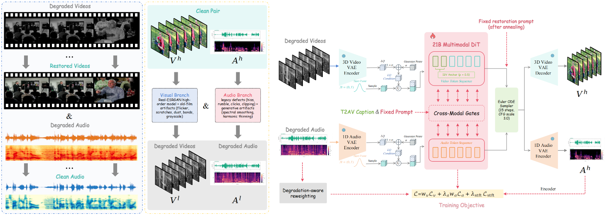

<div align="center">

# OmniVR

### Joint Audio-Video Conditional Generation for Archival Footage Restoration

**Xin Lu**<sup>†</sup> · **Zihao Fan**<sup>†</sup> · **Jie Huang**<sup>‡</sup> · **Mingchen Zhong** · **Hexin Zhang** · **Xueyang Fu**<sup>✉</sup> · **Zheng-Jun Zha**

University of Science and Technology of China

<sup>†</sup> Equal contribution · <sup>‡</sup> Project leader · <sup>✉</sup> Corresponding author

[Latest manuscript · 30 Sep 2026](https://xin1u.github.io/OminiVR_PAGE/assets/OmniVR.pdf) · [arXiv:2608.04224](https://arxiv.org/abs/2608.04224) · [Project page](https://xin1u.github.io/OminiVR_PAGE/) · [GitHub](https://github.com/xin1u/OminiVR) · [Hugging Face](https://huggingface.co/xin1u/OmniVR)

</div>

**30 September 2026:** updated manuscript metadata and framework; complete Flash and multistep inference source is included below. Public multistep weights, benchmark files, and existing reference outputs remain available.

## Abstract

Archival footage often suffers from coupled visual and acoustic degradations, yet most restoration systems process the two modalities separately. To address this problem, we present OmniVR, the first systematic framework for joint audio-video restoration, covering data construction, model adaptation, efficient inference, and evaluation. We construct a high-quality audio-video corpus with detailed captions and use a joint degradation pipeline to produce aligned clean and degraded pairs. Using these pairs, we adapt a pretrained text-to-audio-video model (T2AV) by introducing degraded audio-video conditions (TAV2AV), then progressively replace sample captions with a fixed restoration prompt while retaining caption/null rehearsal. The resulting AV2AV model requires no user-provided text. Under a compatible residual-learning model, we prove that this condition-annealing schedule reduces gradient variance and expected restoration risk relative to direct fixed-prompt adaptation at the same training budget. For efficient deployment, OmniVR-Flash combines reduced-resolution video conditioning, MeanFlow-based one-step distillation, and Turbo VAE, achieving approximately 38 fps at 1K and 18 fps at 2K on a single B200 GPU. We further introduce OmniVRBench to evaluate four complementary dimensions: visual quality, audio quality, temporal consistency, and audio-visual synchrony. OmniVR achieves state-of-the-art results on public benchmarks and OmniVRBench. Data, code, and model weights will be released.

## Framework



OmniVR and OmniVR-Flash framework. (a) Conditional SFT adapts a joint audiovisual DiT with degraded inputs and caption annealing to a fixed prompt. (b) AV MeanFlow enables one-step prediction. (c) Turbo VAE accelerates video encoding and decoding. (d) OmniVR-Flash downsamples LQ video before condition encoding and DiT injection, reducing conditioning cost while preserving high-resolution outputs. The last restored frame anchors the next window.

[Vector framework (PDF)](assets/architecture.pdf) · [Latest manuscript](https://xin1u.github.io/OminiVR_PAGE/assets/OmniVR.pdf)

## Install

Use Python 3.12, a CUDA GPU with BF16 support, and FFmpeg with H.264/AAC
encoding. The source packages are bundled and loaded relative to the
entry-point files; no external LTX checkout or training package is needed.

```bash
git clone https://github.com/xin1u/OminiVR.git
cd OminiVR
python -m venv .venv
source .venv/bin/activate
python -m pip install --index-url https://download.pytorch.org/whl/cu128 \
    torch==2.9.1 torchaudio==2.9.1 torchvision==0.24.1
python -m pip install -r requirements.txt
ffmpeg -version
python infer.py --help
python infer_multistep.py --help
```

The 22B backbone and video window must fit the selected device. Flash keeps
the models resident on one GPU; multistep inference supports VAE tiling and
model offload. Neither command shards one video across multiple GPUs.

## Inference

| | OmniVR-Flash | OmniVR multistep |
|---|---|---|
| Entry point | `infer.py` | `infer_multistep.py` |
| Sampling | One Euler update, `sigma = [1, 0]` | Configurable Euler steps, CFG and STG |
| Video VAE | UltraTinyVAE encoder and decoder | Full LTX video VAE by default |
| Restoration checkpoint | Additive-conditioning Flash LoRA | Channel-concat OmniVR LoRA |
| Text | Fixed prompt cache | Fixed prompt cache or live Gemma encoding |
| Input | File or directory; video and audio required | Directory of MP4 files |

### OmniVR-Flash

Flash requires **three compatible project artifacts**: its additive-conditioning
LoRA, an UltraTinyVAE checkpoint matching the bundled architecture JSON, and
the fixed prompt cache. These artifacts are **not yet included in the public
model repository**. The existing `ominivr_lora_step_01800/02400` and
`taeltx2_3_wide.pth` files are for the multistep/legacy decoder path and cannot
be substituted for Flash weights.

```bash
CUDA_VISIBLE_DEVICES=0 python infer.py \
    --input /path/to/input.mp4 \
    --output /path/to/restored.mp4 \
    --model-path /path/to/ltx-2.3-22b-dev.safetensors \
    --checkpoint /path/to/flash_lora.safetensors \
    --turbo-vae /path/to/turbo_vae.pth \
    --prompt-cache /path/to/flash_prompt_embeddings.pt \
    --width 1920 --height 1080 --frames 121 --frame-rate 24 \
    --verify-output --write-metadata
```

For directory input, replace `--input` / `--output` with `--input-dir` /
`--output-dir`. The models are loaded once and reused. Each source produces
its first requested window. `--frames` must be `8n+1`; short inputs produce
an error. Dimensions are padded to multiples of 32 internally and cropped
back for export. Existing outputs require `--overwrite` to replace them.

### OmniVR multistep

Obtain the base model from [Lightricks/LTX-2.3](https://huggingface.co/Lightricks/LTX-2.3)
and the text encoder from
[google/gemma-3-12b-it-qat-q4_0-unquantized](https://huggingface.co/google/gemma-3-12b-it-qat-q4_0-unquantized),
following their access and license terms. Download a public OmniVR checkpoint:

```bash
hf download xin1u/OmniVR weights/ominivr_lora_step_01800.safetensors --local-dir .
# Controlled-track alternative:
hf download xin1u/OmniVR weights/ominivr_lora_step_02400.safetensors --local-dir .

CUDA_VISIBLE_DEVICES=0 python infer_multistep.py \
    --input_dir /path/to/lq_videos \
    --output_dir /path/to/restored \
    --model_path /path/to/ltx-2.3-22b-dev.safetensors \
    --text_encoder_path /path/to/gemma-3-12b-it-qat-q4_0-unquantized \
    --checkpoint weights/ominivr_lora_step_01800.safetensors \
    --strategy neg_cfg --guidance_scale 3.0 --num_steps 30 \
    --condition_noise 0.3 \
    --width 1920 --height 1088 --max_frames 121 --frame_rate 24
```

The public `step_01800` checkpoint is associated with the real/no-reference
track; `step_02400` is associated with the controlled/full-reference track.
The example uses the existing 30-step configuration. The main-text benchmark
configuration is specified in [Benchmark results](#benchmark-results).

`--strategy` also accepts `no_cfg`, `empty_cfg`, and `all`. Optional STG is
controlled by `--stg_scale`, `--stg_blocks`, and `--stg_mode`. Use
`--num_gpus N` to distribute different input videos across N visible GPUs.
`--audio_denoise` enables the optional audio postprocessing path.

The old command `python scripts/infer.py ...` remains available. Existing
`OMINIVR_MODEL_PATH`, `OMINIVR_TEXT_ENCODER_PATH`, and
`OMINIVR_LORA_STRUCTURE` environment variables are accepted. A compatible
`--prompt_cache` skips Gemma loading; otherwise Gemma is required. For the
optional decoder-only TAEHV checkpoint, see
[the legacy TinyDecoder instructions](ckpt/tinydecoder/README.md).

### Release scope

Both commands include their model loaders, conditioning code, media I/O,
and shared LTX runtime. The supplied export processes clip windows. It does
not expose the reduced-resolution Flash conditioning or automatic
last-frame window chaining depicted in the paper. Training loops and
evaluation scripts are outside this inference release.

See [the detailed inference guide](docs/inference.md) for checkpoint tensor
formats, prompt-cache fields, VAE geometry, tiling, and output validation.

## OmniVRBench and public artifacts

OmniVRBench contains **200 clips**: 71 controlled clips with clean targets
and 129 real archival clips without ground truth. Evaluation covers visual
quality, audio quality, temporal consistency, and audiovisual synchrony.

| Artifact | Location |
|---|---|
| Multistep LoRA checkpoints | [https://huggingface.co/xin1u/OmniVR/tree/main/weights](https://huggingface.co/xin1u/OmniVR/tree/main/weights) |
| Optional legacy TinyDecoder | [https://huggingface.co/xin1u/OmniVR/tree/main/tinydecoder](https://huggingface.co/xin1u/OmniVR/tree/main/tinydecoder) |
| Benchmark and manifest | [https://huggingface.co/xin1u/OmniVR/tree/main/omnibench](https://huggingface.co/xin1u/OmniVR/tree/main/omnibench) |
| Existing multistep reference outputs | [https://huggingface.co/xin1u/OmniVR/tree/main/predictions](https://huggingface.co/xin1u/OmniVR/tree/main/predictions) |

## Benchmark results

Results from Tables 1–4 in the [latest manuscript](https://xin1u.github.io/OminiVR_PAGE/assets/OmniVR.pdf#page=9). Automatic results use the multistep OmniVR configuration in Section 3.6: the 50K-step checkpoint, 15 Euler steps, CFG 3.0, and condition noise 0.5. ↑ / ↓ indicate higher / lower is better; – denotes an unreported metric.

### RTN (Table 1)

3 archival sequences, 600 frames, no ground truth; visual evaluation at 640 × 480.

| Method | MUSIQ ↑ | CLIP-IQA ↑ | NIQE ↓ | MANIQA ↑ | TOPIQ ↑ | BRISQUE ↓ |
|---|---:|---:|---:|---:|---:|---:|
| Low-quality input | 38.71 | 0.258 | 5.94 | 0.188 | 0.267 | 44.66 |
| DeepRemaster | 39.01 | 0.263 | 6.31 | 0.196 | 0.273 | 41.00 |
| RealBasicVSR | 52.18 | 0.362 | 5.87 | 0.285 | 0.438 | 38.72 |
| DDColor | 38.79 | 0.284 | 5.69 | 0.175 | 0.271 | 41.49 |
| ColorMNet | 38.52 | 0.378 | 5.75 | 0.184 | 0.266 | 42.92 |
| MambaOFR | 49.83 | 0.351 | 5.42 | 0.312 | 0.421 | 39.56 |
| **OmniVR (ours)** | **64.77** | **0.426** | **5.14** | **0.330** | **0.553** | **35.90** |

### OmniVRBench: controlled degradation (Table 2)

71 clips with clean references; visual evaluation at 640 × 480. GT denotes the clean reference and is excluded from method comparisons.

| Method | MUSIQ ↑ | CLIP-IQA ↑ | NIQE ↓ | MANIQA ↑ | TOPIQ ↑ | BRISQUE ↓ | DNSMOS ↑ | FAD ↓ | LSE-C ↑ | LSE-D ↓ |
|---|---:|---:|---:|---:|---:|---:|---:|---:|---:|---:|
| Low-quality input | 38.77 | 0.221 | 6.69 | 0.218 | 0.235 | 36.69 | 1.46 | 7.88 | 2.32 | 10.87 |
| DeepRemaster | 37.43 | 0.173 | 6.20 | 0.189 | 0.245 | 35.83 | – | – | – | – |
| RealBasicVSR | 45.54 | 0.226 | 7.08 | 0.294 | 0.326 | 44.96 | – | – | – | – |
| VoiceFixer (audio only) | – | – | – | – | – | – | 2.12 | 7.02 | 1.98 | 11.53 |
| DDColor | 34.07 | 0.200 | 6.34 | 0.200 | 0.250 | 33.61 | – | – | – | – |
| ColorMNet | 34.64 | 0.243 | 6.59 | 0.228 | 0.253 | 35.98 | – | – | – | – |
| MambaOFR | 43.49 | 0.268 | 6.99 | 0.280 | 0.305 | 42.80 | – | – | – | – |
| **OmniVR (ours)** | **71.17** | **0.543** | **4.11** | **0.487** | **0.673** | **24.75** | **2.70** | **6.30** | **3.52** | **10.43** |
| Clean reference (GT) | 67.49 | 0.558 | 4.03 | 0.477 | 0.623 | 25.48 | 2.47 | – | 4.00 | 9.44 |

### OmniVRBench: real archival footage (Table 3)

129 clips without ground truth; visual evaluation at 640 × 480.

| Method | MUSIQ ↑ | CLIP-IQA ↑ | NIQE ↓ | MANIQA ↑ | TOPIQ ↑ | BRISQUE ↓ | DNSMOS ↑ | FAD ↓ | LSE-C ↑ | LSE-D ↓ |
|---|---:|---:|---:|---:|---:|---:|---:|---:|---:|---:|
| Low-quality input | 36.55 | 0.311 | 5.69 | 0.195 | 0.248 | 45.27 | 2.04 | 15.93 | 1.05 | 12.14 |
| DeepRemaster | 38.78 | 0.237 | 7.83 | 0.191 | 0.246 | 48.53 | – | – | – | – |
| RealBasicVSR | 52.38 | 0.401 | 5.82 | 0.342 | 0.468 | 38.15 | – | – | – | – |
| VoiceFixer (audio only) | – | – | – | – | – | – | 2.21 | 9.41 | 0.87 | 13.26 |
| DDColor | 37.51 | 0.307 | 5.49 | 0.164 | 0.278 | 39.21 | – | – | – | – |
| ColorMNet | 38.64 | 0.421 | 5.59 | 0.174 | 0.275 | 42.74 | – | – | – | – |
| MambaOFR | 49.59 | 0.394 | 5.62 | 0.331 | 0.440 | 44.00 | – | – | – | – |
| **OmniVR (ours)** | **61.87** | **0.444** | **5.40** | **0.383** | **0.531** | **36.02** | **2.43** | **8.32** | **1.12** | **11.39** |

### Human preference (Table 4)

Mean pairwise 2AFC win rates (%) on 129 archival clips, judged by 12 annotators. The gain row is measured in percentage points.

| Method | Visual ↑ | Audio ↑ | Sync ↑ | Overall ↑ |
|---|---:|---:|---:|---:|
| LQ input | 19.5 | 24.2 | 27.0 | 21.1 |
| MambaOFR + VoiceFixer | 46.7 | 48.7 | 48.3 | 47.7 |
| RealBasicVSR + VoiceFixer | 58.0 | 54.9 | 53.5 | 56.5 |
| Old Films + VoiceFixer | 43.7 | 43.9 | 43.8 | 44.1 |
| Pretrained AV gen. | 39.8 | 38.9 | 39.8 | 39.6 |
| **OmniVR (ours)** | **92.2** | **89.4** | **87.6** | **91.0** |
| Gain vs. best baseline | +34.2 pp | +34.5 pp | +34.1 pp | +34.5 pp |

## License and acknowledgments

The current inference bundle and LTX-derived model weights use the
[LTX-2 Community License Agreement](LICENSE), including its attachments.
Bundled LTX components retain their upstream notices. The optional legacy
TAEHV implementation retains its MIT attribution in [NOTICE](NOTICE).
Earlier Apache-2.0 attribution is retained in `licenses/Apache-2.0.txt`.
The Google Gemma text encoder remains subject to its own upstream terms.

We acknowledge [Lightricks/LTX-2](https://github.com/Lightricks/LTX-2) and
[Seraena/TAESD](https://github.com/madebyollin/seraena).

## Citation

```bibtex
@article{lu2026omnivr,
  title={OmniVR: Joint Audio-Video Conditional Generation for Archival Footage Restoration},
  author={Lu, Xin and Fan, Zihao and Huang, Jie and Zhong, Mingchen and Zhang, Hexin and Fu, Xueyang and Zha, Zheng-Jun},
  journal={arXiv preprint arXiv:2608.04224},
  year={2026},
  eprint={2608.04224},
  archivePrefix={arXiv},
  primaryClass={cs.CV},
  url={https://arxiv.org/abs/2608.04224}
}
```

Contact: [luxion@mail.ustc.edu.cn](mailto:luxion@mail.ustc.edu.cn).
